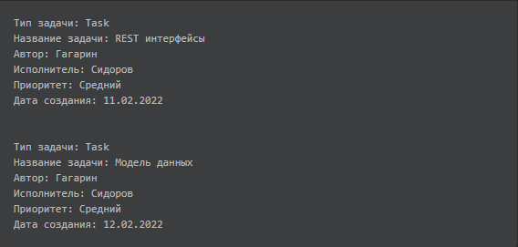

# Лабораторная №1

### Практика, первая часть.

#### Цель:

- Научиться создавать проект с нуля
- Научиться работать с базовой java, так называемой java core
- Научится работать с чтением и записью файлов
- Научится работать с библиотеками, в текущей практике CSVParser и Lombok

#### Теория:

- Коллекции:  
  https://habr.com/ru/post/237043/  
  https://skillbox.ru/media/code/gotovimsya_k_sobesedovaniyu_chto_nuzhno_znat_o_kollektsiyakh_v_java/
- Исключения (Exceptions)  
  https://javarush.ru/groups/posts/isklyucheniya-java
- Input/OutputStream:  
  http://proglang.su/java/io-and-files-and-directories
- Лямбды  
  https://habr.com/ru/post/512730/
- Stream API  
  https://habr.com/ru/company/luxoft/blog/270383/
- Дженерики  
  https://javarush.ru/groups/posts/2004-teorija-dzhenerikov-v-java-ili-gde-na-praktike-stavitjh-skobki
- Запись в файл
  https://metanit.com/java/tutorial/6.8.php
  http://proglang.su/java/io-and-files-and-directories-filewriter-class

#### Пара слов о целях первой части:
Перед тем, как сворачивать горы, писать клиент-серверные приложения с использованием всех современных фреймворков,
необходимо пощупать именно java core. Задачи, которые представлены в текущей практике, постоянно ставятся в промышленных
проектах, по опыту, в каждом проекте есть задачи что-то импортировать и что-то экспортировать. Так же просим не
пренебрегать ссылками на теорию, которые мы даем, они позволят вам углубить знания.

#### Практические задачи:

1. Подготовить среду разработки, установить maven, IDE, java (jdk)
2. Создать "с нуля" проект со сборщиком maven, вывести текст в консоль и проверить, что он запускается и работает
3. Реализовать функционал чтения csv файла из ресурсов проекта
4. Реализовать функционал парсинга csv файла и маппинга его строк в заранее заготовленный класс
   с последующим добавлением всех строк в коллекцию
5. Реализовать функционал фильтрации полученной коллекции по одному/нескольким, переданным через аргументы (при запуске приложения)
6. Реализовать функционал сортировки полученной коллекции по определённому полю, переданному через аргументы (при запуске приложения)
7. Реализовать функционал записи текстового файла в заданную папку. Файл должен опираться на данные из загруженного csv.
   Пример файла csv: [пример](csv/example.csv). Из него берем каждую строку, обогащаем её заголовками и записываем в текстовый
   файл разделяя дополнительным переводом строки. Например, у нас в файле 2 строки:
    - "Task","REST интерфейсы","Гагарин","Сидоров","Средний","11.02.2022"
    - "Task","Модель данных","Гагарин","Сидоров","Средний","12.02.2022"

   В результирующем текстовом файле они должны выглядеть так:



В результирующем файле данные должны быть отфильтрованы и отсортированы, согласно п.5 и п.6 задач.

8. Применить на проекте библиотеку Lombok
9. Реализовать "самодельные" тесты на написанный функционал, повызывать написанные методы с разными передаваемыми параметрами
   и проверить ими функционал. Как бонус, вместо этого можно написать сразу "правильные" тесты используя библиотеку JUnit.

#### Примеры решения конкретных задач:

*Чтение файла из ресурсов проекта:*

Вариант из лекции:
```
var csvStream = Application.class.getResourceAsStrean(" %path% ")
```

Альтернатива:
```
ClassLoader classLoader = getClass().getClassLoader();

try (InputStream inputStream = classLoader.getResourceAsStream(" %path% ")) {
    // логика
} catch (IOException e) {
    // обработка catched exception        
}
```

*Парсинг csv:*

```
new CsvToBeanBuilder<TaskCsv>(new InputStreamReader(Objects.requireNonNull(csvStream)))
    .withSeparator(';')
    .withType(TaskCsv.class)
    .withSkipLines(1)
    .build()
    .parse();
```
Используя паттерн Builder, мы собираем парсер, указываем необходимые параметры и вызываем метод parse() для, собственно,
парсинга самого файла.

*Фильтрация и сортировка:*

Есть несколько подходов к реализации подобных задач, выделить можно два. Первый — это изобретение велосипеда,
берём коллекцию, перебираем её в цикле for и делаем с ней всё, что душе угодно. Второй — использование java stream api
как показано на лекции
```
tasks.stream()
    .sorted(Comparator.comparing(TaskCsv::getName))
```
В данном примере, показана сортировка коллекции по названию.

*Пример чтения информации о фильтрах и сортировках из командной строки*

Пусть, параметры в командной строке будут такого вида:  
`-f name=Иван -f type=TASK -s name=asc -s type=desc`  
Где `-f` - ключ, за которым идёт имя_поля=значение фильтра, а `-s` - ключ, за которым идёт имя_поля=тип_сортировки

Пример кода без сторонних библиотек для парсинга подобной строки:
```
import java.util.ArrayList;
import java.util.List;

public class KeysReaderApplication {

    public static void main(String[] args) {
        List<String> filters = new ArrayList<>();
        List<String> sorts = new ArrayList<>();
        int index = 0;

        // перебор опций
        while (index < args.length) {
            switch (args[index]) {
                case "-f":
                    filters.add(args[++index]);
                    break;
                case "-s":
                    sorts.add(args[++index]);
                    break;
            }
            index++;
        }

        // пример как извлекать фильтры
        filters.forEach(f -> {
            String[] filter = f.split("=");
            System.out.printf("Название фильтра: '%s', значение фильтра: '%s'%n", filter[0], filter[1]);
        });

        // просто вывод массива с сортировками, пояснения asc - прямой порядок, desc - обратный порядок
        System.out.println(sorts);
    }

}
```

Парсинг параметров может быть реализован любыми другими способами, выше показан лишь один из вариантов формата и его парсинга

#### Факультативное чтение:
- Мультипоточность  
  https://habr.com/ru/post/164487/  
  https://habr.com/ru/post/554608/  
  https://javarush.ru/groups/posts/2047-threadom-java-ne-isportishjh--chastjh-i---potoki
- Интерфейсы
  https://javarush.ru/groups/posts/1981-dlja-chego-v-java-nuzhnih-interfeysih
  
