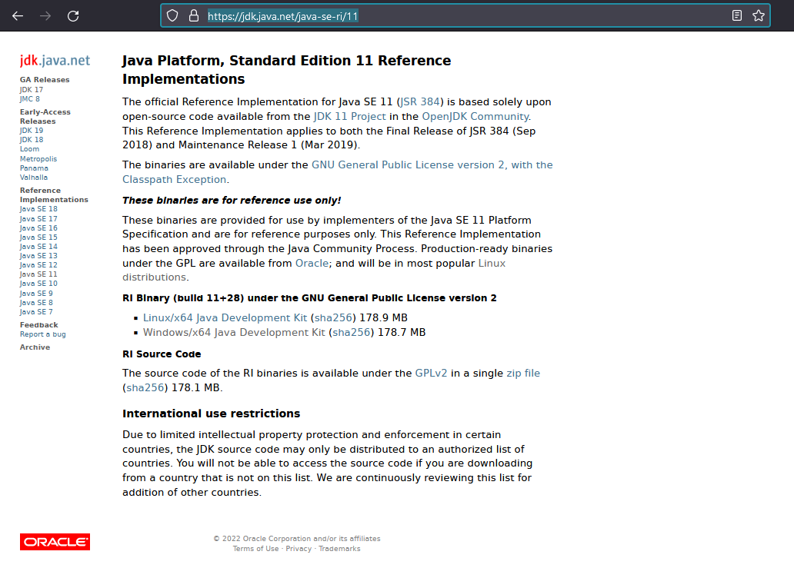
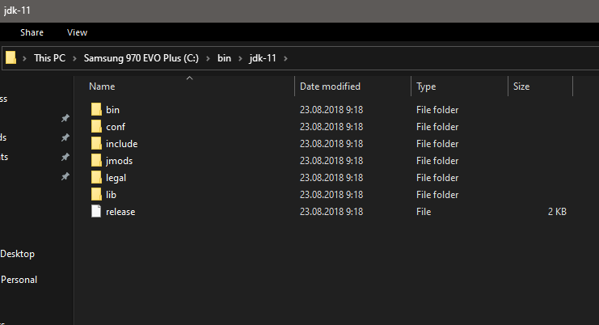
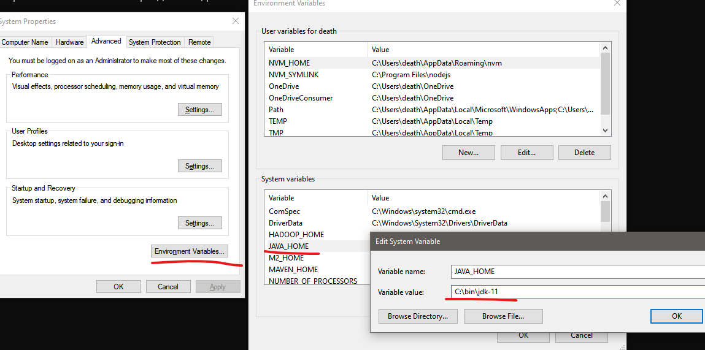
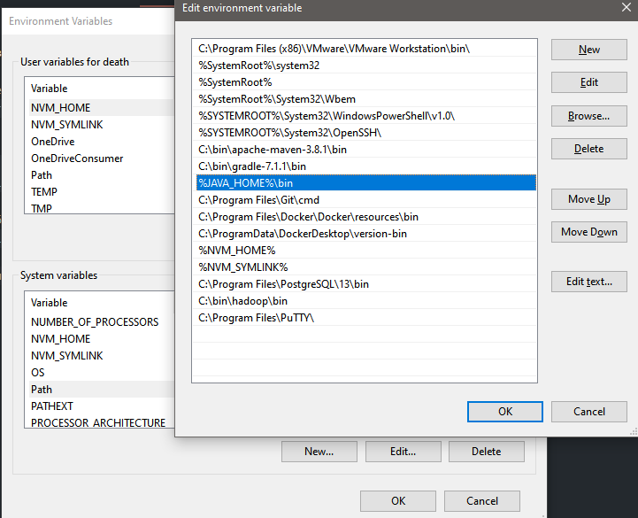
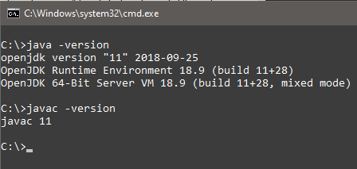
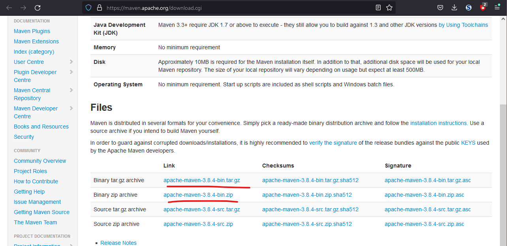
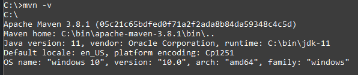

## Среда разработки

### 1. Установка JDK 11 (Windows)

Установщик OpenJDK 11 можно скачать отсюда: [jdk.java.net/java-se-ri/11](https://jdk.java.net/java-se-ri/11)  

Для установки скачать архив `Windows/x64 Java Development Kit` и распаковать, например, в директорию C:\bin  
Содержимое `C:\bin\jdk-11` (внутри архива на момент написания инструкции папка jdk-11):    

Далее надо добавить переменную окружения `JAVA_HOME` со значением `C:\bin\jdk-11`:  

Там же нужно найти переменную окружения Path и добавить в ней путь к bin нашего jdk: `%JAVA_HOME%\bin`  

Чтобы проверить, что изменения применились, нужно открыть новое окно консоли/терминала и там ввести `java -version`
и `javac -version`, в консоли не должно быть ошибок:  

Аналогичным образом установка делается в линуксах, отличается только способ установки переменных окружения и пути размещения
бинарников. Не рекомендуется делать настройку из под root, лучше всё делать от обычного пользователя и размещать бинарники
в его home-директории, чтобы в будущем не возникало проблем с правами доступа.

### 2. Установка Apache Maven
Apache Maven - система организации структуры проекта, сборки и зависимостей (если вкратце). Установка производится либо
бинарником, либо из архива аналогично как JDK, скачать отсюда: [maven.apache.org](https://maven.apache.org/download.cgi)  

Скачать и распаковать архив в C:\bin, получится: `C:\bin\apache-maven-3.8.4`  
Таким же путём, как и выше по JDK, создать переменную окружения `M2_HOME` со значением `C:\bin\apache-maven-3.8.4`  
В переменную `Path` добавить значение `%M2_HOME%\bin`  
После этого открыть новое окно консоли/терминала и выполнить команду `mvn -v`:  

Примечание: на скрине иная версия Apache Maven, автор устанавливал свой maven раньше написания инструкции. После
публикации инструкции версия может стать новее, чем 3.8.4 - надо не забыть про это при установке значений переменным.

### 3. Установка IDE: IntelliJ IDEA
Рекомендуется JetBrains IntelliJ IDEA Ultimate. Для студентов выдаются бесплатные лицензии, за подробностями идти на
их [сайт](https://www.jetbrains.com/ru-ru/community/education/#students). Можно и другую IDE, не от JetBrains, но с
технологиями из курса лучше всего интегрированы среды разработки от JetBrains
